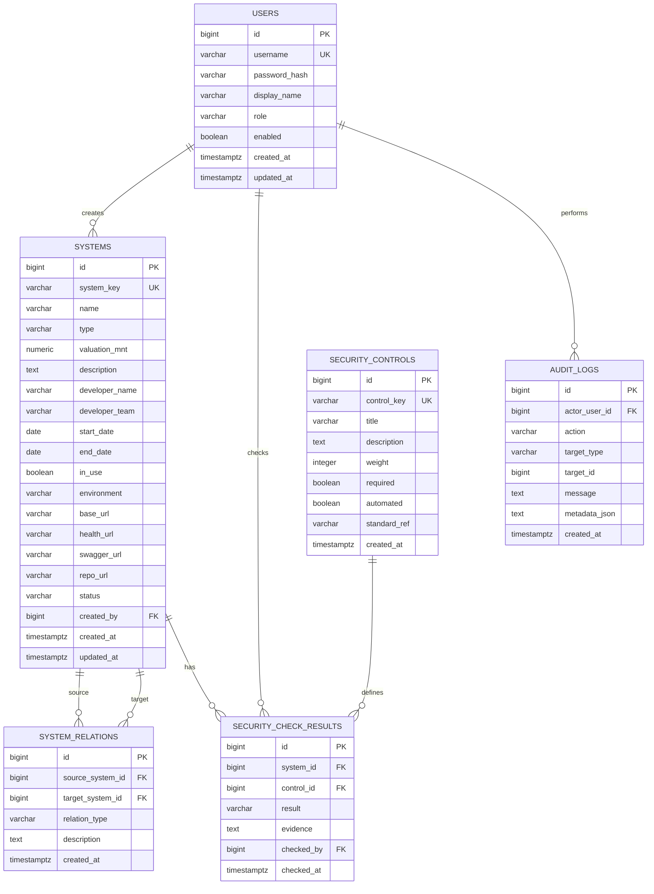

# Database Relations and DBRD

Огноо: 2026-07-06

Хамаарах migration:

- `backend/platform-api/src/main/resources/db/migration/V1__init_schema.sql`
- `backend/platform-api/src/main/resources/db/migration/V2__seed_security_controls.sql`
- `backend/platform-api/src/main/resources/db/migration/V3__seed_demo_data.sql`

## 1. DBRD зорилго

DBRD буюу Database Requirements and Relationship Document нь энэ төслийн өгөгдлийн сангийн бүтэц, хүснэгтүүдийн үүрэг, хоорондын relation, constraint, seed data, цаашдын өргөтгөлийн чиглэлийг тайлбарлана.

Энэ database нь PDF даалгаврын гол шаардлагыг дэмжинэ:

- хэрэглэгч нэвтрэх,
- системийн бүртгэл хийх,
- системүүдийн холбоо бүртгэх,
- мэдээллийн аюулгүй байдлын стандарт шалгах,
- жагсаалт болон хайлт хийх,
- өөрчлөлтийн audit log хадгалах.

## 2. Logical ERD



## 3. Table overview

| Table | Үүрэг | PDF шаардлагатай холбоо |
| --- | --- | --- |
| `users` | Нэвтрэх хэрэглэгч, role, password hash хадгална | Хэрэглэгч нэвтрэх, хэрэглэгчийн нэр/нууц үг хадгалах |
| `systems` | Бүртгэгдсэн системийн үндсэн мэдээлэл | Системийн бүртгэл, жагсаалт, хайлт |
| `system_relations` | Нэг систем нөгөө системтэй ямар хамааралтайг хадгална | Холбоотой системүүд |
| `security_controls` | Шалгах security standard/control-ийн master data | Мэдээллийн аюулгүй байдлын стандартууд |
| `security_check_results` | Тухайн систем дээр тухайн standard PASS/FAIL эсэх | Security standard шалгах |
| `audit_logs` | Хэн, хэзээ, ямар үйлдэл хийснийг хадгална | Enterprise нэмэлт, traceability |

## 4. Relationship detail

### 4.1. `users` -> `systems`

Cardinality:

```text
users 1 ---- 0..N systems
```

Relation:

- `systems.created_by` -> `users.id`

Утга:

- Нэг хэрэглэгч олон систем бүртгэж болно.
- Нэг системийг анх үүсгэсэн хэрэглэгчийг хадгална.
- `created_by` nullable байгаа нь seed/import үед user unknown байж болохыг зөвшөөрч байна.

Delete behavior:

- `created_by` дээр `on delete cascade` байхгүй.
- User устгасан ч систем автоматаар устахгүй.
- Production дээр user-г hard delete хийхээс илүү `enabled=false` болгох нь зөв.

### 4.2. `systems` -> `system_relations`

Cardinality:

```text
systems 1 ---- 0..N system_relations as source
systems 1 ---- 0..N system_relations as target
```

Relation:

- `system_relations.source_system_id` -> `systems.id`
- `system_relations.target_system_id` -> `systems.id`

Утга:

- Энэ нь self-referencing many-to-many relation.
- Нэг систем олон системтэй холбогдож болно.
- Нэг систем олон системийн target болж болно.

Жишээ:

```text
Digital Banking Service CALLS Banking Transfer Service
Banking Transfer Service INTEGRATES_WITH Card Service
```

Constraint:

- `source_system_id <> target_system_id`: систем өөрөө өөртэйгээ relation үүсгэхгүй.
- `(source_system_id, target_system_id, relation_type)` unique: нэг relation давхардахгүй.
- `relation_type`: `DEPENDS_ON`, `CALLS`, `INTEGRATES_WITH`.

Delete behavior:

- `on delete cascade`.
- System устахад түүнтэй холбоотой relation-ууд автоматаар устна.

### 4.3. `systems` -> `security_check_results`

Cardinality:

```text
systems 1 ---- 0..N security_check_results
```

Relation:

- `security_check_results.system_id` -> `systems.id`

Утга:

- Нэг систем олон security check result-тэй байна.
- Жишээ нь нэг систем дээр `HTTPS_ENABLED`, `AUTHENTICATION_ENABLED`, `AUDIT_LOG_ENABLED` гэх мэт control шалгана.

Delete behavior:

- `on delete cascade`.
- System устахад тухайн system-ийн security result-ууд устна.

### 4.4. `security_controls` -> `security_check_results`

Cardinality:

```text
security_controls 1 ---- 0..N security_check_results
```

Relation:

- `security_check_results.control_id` -> `security_controls.id`

Утга:

- `security_controls` нь checklist-ийн master data.
- `security_check_results` нь тухайн system дээрх бодит шалгалтын үр дүн.

Constraint:

- `(system_id, control_id)` unique.
- Нэг систем дээр нэг control-ийн нэг л result байна.

Result values:

```text
PASS
FAIL
WARNING
NOT_CHECKED
```

Score calculation-д ашиглах санал:

```text
PASS        = full weight
WARNING     = 50% weight
FAIL        = 0
NOT_CHECKED = 0
```

### 4.5. `users` -> `security_check_results`

Cardinality:

```text
users 1 ---- 0..N security_check_results
```

Relation:

- `security_check_results.checked_by` -> `users.id`

Утга:

- Тухайн security check-ийг хэн хийсэн эсвэл шинэчилснийг хадгална.
- `checked_by` nullable байж болно. Автомат шалгалт эсвэл seed data үед user байхгүй байж болно.

### 4.6. `users` -> `audit_logs`

Cardinality:

```text
users 1 ---- 0..N audit_logs
```

Relation:

- `audit_logs.actor_user_id` -> `users.id`

Утга:

- Хэн систем үүсгэсэн, зассан, security check өөрчилсөн, login хийсэн зэрэг event-ийг хадгална.
- `actor_user_id` nullable: system job эсвэл automated action байж болно.

Important note:

- `audit_logs.target_id` нь одоогоор polymorphic reference. DB foreign key биш.
- `target_type` + `target_id` хосоор `SYSTEM`, `SECURITY_CHECK`, `USER` гэх мэт target-ийг заана.
- Энэ нь audit log-ийг олон entity дээр ашиглах уян хатан загвар.

## 5. Column-level requirements

### 5.1. `users`

| Column | Type | Constraint | Тайлбар |
| --- | --- | --- | --- |
| `id` | `bigserial` | PK | User-ийн unique ID |
| `username` | `varchar(80)` | not null, unique | Login username |
| `password_hash` | `varchar(255)` | not null | Plain password биш BCrypt hash |
| `display_name` | `varchar(160)` | not null | UI дээр харагдах нэр |
| `role` | `varchar(30)` | check | `ADMIN`, `SECURITY`, `VIEWER` |
| `enabled` | `boolean` | default true | User идэвхтэй эсэх |
| `created_at` | `timestamptz` | default now | Үүссэн огноо |
| `updated_at` | `timestamptz` | default now | Зассан огноо |

### 5.2. `systems`

| Column | Type | Constraint | PDF mapping |
| --- | --- | --- | --- |
| `id` | `bigserial` | PK | Internal ID |
| `system_key` | `varchar(80)` | not null, unique | Stable key |
| `name` | `varchar(160)` | not null | Системийн нэр |
| `type` | `varchar(30)` | check | Төрөл |
| `valuation_mnt` | `numeric(18,2)` | >= 0 | Үнэлгээ/төг |
| `description` | `text` | nullable | Тайлбар |
| `developer_name` | `varchar(160)` | nullable | Хөгжүүлэгч |
| `developer_team` | `varchar(160)` | nullable | Хөгжүүлэгч баг |
| `start_date` | `date` | nullable | Хугацаа эхлэх |
| `end_date` | `date` | nullable | Хугацаа дуусах |
| `in_use` | `boolean` | default true | Ашиглагдаж байгаа эсэх |
| `environment` | `varchar(30)` | check | DEV/TEST/UAT/PROD |
| `base_url` | `varchar(500)` | nullable | Enterprise нэмэлт |
| `health_url` | `varchar(500)` | nullable | Health check нэмэлт |
| `swagger_url` | `varchar(500)` | nullable | API docs нэмэлт |
| `repo_url` | `varchar(500)` | nullable | Git repo нэмэлт |
| `status` | `varchar(30)` | check | ACTIVE/INACTIVE/UNKNOWN/DOWN |
| `created_by` | `bigint` | FK nullable | Бүртгэсэн user |
| `created_at` | `timestamptz` | default now | Үүссэн огноо |
| `updated_at` | `timestamptz` | default now | Зассан огноо |

Allowed `type` values:

| DB value | UI label |
| --- | --- |
| `CARD` | Карт |
| `CORE` | Коре |
| `INTERNAL` | Дотоод |
| `DIGITAL` | Дижитал |

### 5.3. `system_relations`

| Column | Type | Constraint | Тайлбар |
| --- | --- | --- | --- |
| `id` | `bigserial` | PK | Relation ID |
| `source_system_id` | `bigint` | FK, not null | Эх систем |
| `target_system_id` | `bigint` | FK, not null | Холбогдож байгаа систем |
| `relation_type` | `varchar(30)` | check | Хамаарлын төрөл |
| `description` | `text` | nullable | Relation тайлбар |
| `created_at` | `timestamptz` | default now | Үүссэн огноо |

Allowed `relation_type` values:

| Value | Утга |
| --- | --- |
| `DEPENDS_ON` | Ажиллахын тулд нөгөө системээс хамаарна |
| `CALLS` | API/service call хийдэг |
| `INTEGRATES_WITH` | Интеграцтай |

### 5.4. `security_controls`

| Column | Type | Constraint | Тайлбар |
| --- | --- | --- | --- |
| `id` | `bigserial` | PK | Control ID |
| `control_key` | `varchar(80)` | unique | Checklist key |
| `title` | `varchar(180)` | not null | UI дээр харагдах нэр |
| `description` | `text` | nullable | Тайлбар |
| `weight` | `integer` | > 0 | Score calculation weight |
| `required` | `boolean` | default true | Заавал эсэх |
| `automated` | `boolean` | default false | Автоматаар шалгах эсэх |
| `standard_ref` | `varchar(160)` | nullable | OWASP ASVS/API Security гэх мэт |
| `created_at` | `timestamptz` | default now | Үүссэн огноо |

Seed controls:

- `HTTPS_ENABLED`
- `AUTHENTICATION_ENABLED`
- `ROLE_BASED_ACCESS`
- `AUDIT_LOG_ENABLED`
- `SECRETS_NOT_IN_CODE`
- `SWAGGER_PROTECTED`
- `CORS_RESTRICTED`
- `INPUT_VALIDATION`

### 5.5. `security_check_results`

| Column | Type | Constraint | Тайлбар |
| --- | --- | --- | --- |
| `id` | `bigserial` | PK | Result ID |
| `system_id` | `bigint` | FK, not null | Аль систем дээр шалгасан |
| `control_id` | `bigint` | FK, not null | Ямар control шалгасан |
| `result` | `varchar(30)` | check | PASS/FAIL/WARNING/NOT_CHECKED |
| `evidence` | `text` | nullable | Нотлох тайлбар |
| `checked_by` | `bigint` | FK nullable | Шалгасан user |
| `checked_at` | `timestamptz` | default now | Шалгасан огноо |

Business rule:

- Нэг system дээр нэг security control нэг л result-тэй байна.
- Үүнийг `security_check_results_unique` constraint хамгаална.

### 5.6. `audit_logs`

| Column | Type | Constraint | Тайлбар |
| --- | --- | --- | --- |
| `id` | `bigserial` | PK | Audit ID |
| `actor_user_id` | `bigint` | FK nullable | Үйлдэл хийсэн user |
| `action` | `varchar(80)` | not null | Үйлдлийн төрөл |
| `target_type` | `varchar(80)` | not null | `SYSTEM`, `SECURITY_CHECK`, `AUTH` гэх мэт |
| `target_id` | `bigint` | nullable | Target entity ID |
| `message` | `text` | not null | Хүн унших тайлбар |
| `metadata_json` | `text` | nullable | Нэмэлт JSON |
| `created_at` | `timestamptz` | default now | Үүссэн огноо |

Санал болгох `action` values:

- `LOGIN_SUCCESS`
- `LOGIN_FAILED`
- `SYSTEM_CREATED`
- `SYSTEM_UPDATED`
- `SYSTEM_DISABLED`
- `SECURITY_CHECK_UPDATED`
- `SECURITY_SCORE_CHANGED`

## 6. Physical constraints

Primary keys:

- `users.id`
- `systems.id`
- `system_relations.id`
- `security_controls.id`
- `security_check_results.id`
- `audit_logs.id`

Unique constraints:

- `users.username`
- `systems.system_key`
- `security_controls.control_key`
- `system_relations(source_system_id, target_system_id, relation_type)`
- `security_check_results(system_id, control_id)`

Check constraints:

- `users.role in ('ADMIN', 'SECURITY', 'VIEWER')`
- `systems.type in ('CARD', 'CORE', 'INTERNAL', 'DIGITAL')`
- `systems.environment in ('DEV', 'TEST', 'UAT', 'PROD')`
- `systems.status in ('ACTIVE', 'INACTIVE', 'UNKNOWN', 'DOWN')`
- `systems.valuation_mnt >= 0`
- `systems.start_date <= systems.end_date` if both are present
- `system_relations.source_system_id <> target_system_id`
- `system_relations.relation_type in ('DEPENDS_ON', 'CALLS', 'INTEGRATES_WITH')`
- `security_controls.weight > 0`
- `security_check_results.result in ('PASS', 'FAIL', 'WARNING', 'NOT_CHECKED')`

Indexes:

- `idx_systems_name`
- `idx_systems_type`
- `idx_systems_in_use`
- `idx_systems_status`
- `idx_audit_logs_created_at`

## 7. Search and reporting support

Current indexes support these first MVP queries:

```text
Search system by name
Filter by type
Filter by in_use
Filter by status
Sort audit logs by created_at desc
```

Recommended future indexes:

```sql
create index idx_systems_developer_name on systems(developer_name);
create index idx_systems_environment on systems(environment);
create index idx_security_check_results_system on security_check_results(system_id);
create index idx_system_relations_source on system_relations(source_system_id);
create index idx_system_relations_target on system_relations(target_system_id);
```

Full-text search хэрэгтэй бол дараа нь PostgreSQL `tsvector` эсвэл simple `ilike` query ашиглаж болно. MVP-д `name`, `developer_name`, `developer_team` дээр `ilike` хангалттай.

## 8. Normalization

Одоогийн schema нь MVP түвшинд 3NF-д ойр:

- User мэдээлэл `users` table-д тусдаа.
- System үндсэн metadata `systems` table-д.
- Many-to-many system dependency `system_relations` table-д тусдаа.
- Security checklist master data `security_controls` table-д.
- Security check transaction/result data `security_check_results` table-д.
- Audit event data `audit_logs` table-д.

Зориуд denormalized үлдээсэн хэсэг:

- `developer_name`, `developer_team` нь одоогоор free text.
- Дараа нь team/user management хэрэгтэй бол `teams` table болгон салгаж болно.
- `audit_logs.target_id` нь foreign key биш. Audit log олон төрлийн entity дээр ажиллахын тулд polymorphic design сонгосон.

## 9. Seed data

`V2__seed_security_controls.sql`:

- 8 security control seed хийдэг.
- Эдгээр нь system бүр дээр checklist болон score calculation-д ашиглагдана.

`V3__seed_demo_data.sql`:

- `admin` user үүсгэнэ.
- Password DB дээр BCrypt hash байдлаар хадгалагдана.
- 3 demo system үүсгэнэ:
  - `Banking Transfer Service`
  - `Card Service`
  - `Digital Banking Service`
- Demo relation:
  - Banking Transfer -> Card: `INTEGRATES_WITH`
  - Banking Transfer -> Digital Banking: `CALLS`

## 10. Current limitations

Одоогийн DB design санаатайгаар жижиг MVP-д зориулсан.

Хязгаарлалтууд:

- `teams` table хараахан байхгүй.
- `developer_name` free text.
- `status` болон `in_use` хоёрын business meaning-г service layer дээр тодорхой барих хэрэгтэй.
- `audit_logs.target_id` foreign key биш.
- `updated_at` автоматаар update хийх trigger одоогоор байхгүй.
- Health check history table хараахан үүсээгүй.
- JWT token/session table байхгүй, stateless JWT ашиглах төлөвтэй.

## 11. Next DB improvements

System CRUD дууссаны дараа нэмэх санал:

```sql
teams
system_health_checks
system_api_documents
```

`teams`:

- owner/developer багийг structured болгоно.

`system_health_checks`:

- service health шалгалтын түүх хадгална.

`system_api_documents`:

- swagger/openapi document metadata хадгална.

## 11.b. Deposit service DB (тусдаа Postgres 5434, `deposit_service`)

`deposit-service` нь database-per-service зарчмаар өөрийн тусдаа Postgres-тэй. Харилцагчийн
хүснэгт ДАВХАРДУУЛАХГҮЙ — cross-service холбоос нь soft reference (FK биш):

- **`deposits`** (V1): `id`, `deposit_no` (unique), `client_request_key` (nullable unique —
  browser идемпотент), `customer_username` (↔ platform `users.username`), `linked_account_no`
  (↔ banking `accounts.account_no`), `principal`, `annual_rate`, `term_months`, `opened_at`,
  `maturity_date`, `status` CHECK(FUNDING/OPEN/PAYOUT_PENDING/CLOSED/CLOSED_EARLY/CANCELLED),
  `close_type` CHECK(EARLY/MATURED), `interest_amount`, `payout_amount`, `funding_transfer_ref`
  (↔ banking `transfers.transfer_ref`), `payout_transfer_ref`, `failure_reason`, `closed_at`.
  Sequence `deposit_no_seq` (DEP-5001-ээс).
- **`deposit_audit_logs`** (V1): banking-ийн `bank_audit_logs`-тэй ижил бүтэц — actor нь JWT-ээс
  авсан snapshot (users platform DB-д тул FK боломжгүй).

Cross-service мөнгөний холбоос: хадгаламжийн үндсэн дүн banking-ийн settlement данс `900000001`
(эзэн `svc-deposit`)-д банкны transfer-ээр байршиж, хаахад мөн банкны transfer-ээр буцна. Хоёр
DB-ийн хооронд шууд FK байхгүй — зөвхөн transfer_ref/username/account_no-гоор логик холбогдоно.

## 12. Implementation rule

DB migration дүрэм:

- Одоо үүссэн migration файлуудыг production мэт авч үзнэ.
- Schema өөрчлөх бол байгаа migration-ийг edit хийхээс илүү шинэ `V4__...sql` үүсгэнэ.
- Test profile дээр Flyway migration заавал ногоон байх ёстой.
- JPA entity болон migration schema зөрөх ёсгүй.

Verification command:

```powershell
$env:JAVA_HOME='C:\Users\basba\.jdk\jdk-17.0.16'
$env:Path="$env:JAVA_HOME\bin;$env:Path"
cd backend/platform-api
mvn test
```

