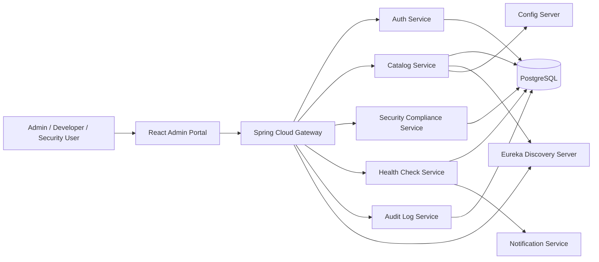
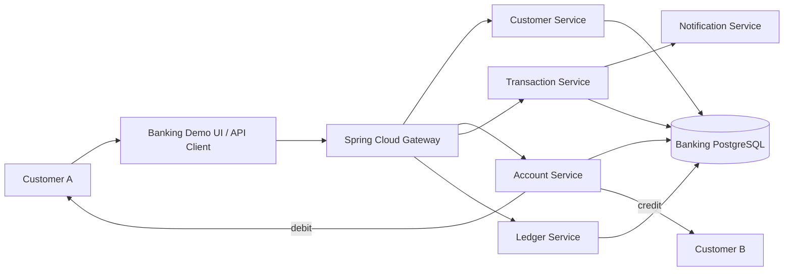
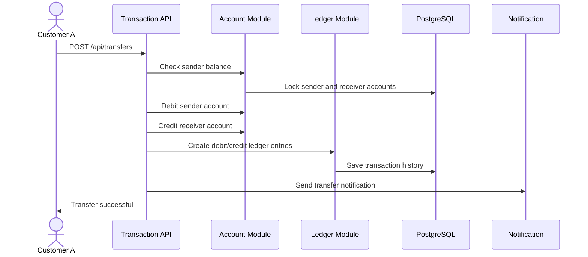
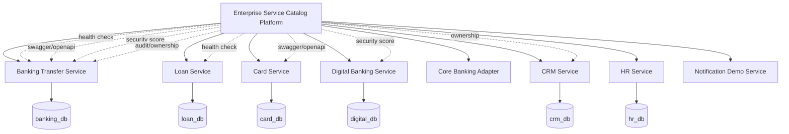
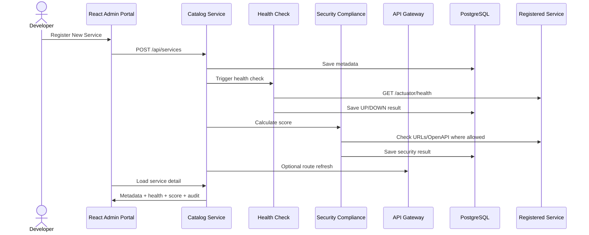

# Хөгжүүлэлт эхлэх судалгаа

Огноо: 2026-07-06

Эх концепц: `төслийн concept/гол агуулга`

## 1. Төслийн тодорхойлолт

Төслийн нэрийг дараах байдлаар байршуулбал илүү мэргэжлийн харагдана:

**Enterprise Service Catalog & Registry Platform**

Гол зорилго:

- Байгууллагын бүх систем, сервис, API, эзэмшигч баг, орчин, health status, security compliance мэдээллийг нэг төвөөс бүртгэж хянах.
- Шинэ сервис нэмэгдэхэд catalog-д бүртгээд, health/API/security мэдээллийг автоматаар шалгаж, dashboard дээр харуулах.
- Цаашдаа Spring Cloud Gateway, Eureka, Config Server, Notification, Audit Log зэрэг enterprise microservice ойлголтуудыг холбож өргөтгөх.

Хамгийн чухал ялгаа:

- **Service Catalog**: системийн нэр, owner, repo, API, environment, compliance зэрэг удаан хадгалагдах метадата.
- **Service Discovery / Eureka**: одоо ажиллаж байгаа сервис instance-үүдийг runtime дээр олох registry.
- **API Gateway**: хэрэглэгчийн request-ийг тохирох backend сервис рүү route хийх, security/monitoring/rate limit зэрэг cross-cutting concern хэрэгжүүлэх entry point.

Тиймээс эхний хувилбарт catalog-г үндсэн цөм болгоод, Eureka болон Gateway-г дараагийн шатанд холбох нь хамгийн зөв.

## 2. Benchmark судалгаа

Backstage-ийн Software Catalog нь ownership болон metadata-г төвлөрүүлж, services, websites, libraries, data pipelines гэх мэт software ecosystem-ийн зүйлсийг бүртгэдэг. Тэдний system model-д гол entity нь:

- Component - backend service, frontend app, library гэх мэт software piece.
- API - component хоорондын boundary.
- Resource - database, bucket, queue зэрэг runtime infrastructure.
- System - хамт ажиллаж нэг capability үүсгэдэг component/resource/API багц.
- Domain - business чиглэлийн том бүлэглэл.

Энэ төслийг Backstage шиг бүрэн developer portal болгох шаардлагагүй. Гэхдээ entity model-ийн санааг авч `service`, `api`, `resource`, `team`, `environment`, `security_score` гэсэн data model-той эхэлбэл бодит байгууллагын хэрэглээнд ойр болно.

## 3. Санал болгож буй MVP архитектур

Эхний хөгжүүлэлтэд хэт олон сервис задлахгүй, гэхдээ microservice architecture-ийн гол санааг харуулах хэмжээний бүтэц:

```text
React Admin Portal
        |
Spring Cloud Gateway
        |
------------------------------------------------
|                    |                         |
Catalog Service      Auth Service              Demo Service
system/security/     JWT login/RBAC            loan-service гэх мэт
health/audit
        |
PostgreSQL

Optional next:
Discovery Server (Eureka)
Config Server
Notification Service
Monitoring
```

Эхний ээлжийн repo бүтэц:

```text
service-catalog-platform/
  frontend/
  gateway-service/
  catalog-service/
  auth-service/
  discovery-server/
  demo-services/
    loan-service/
  docker-compose.yml
  README.md
```

Хэрэв хугацаа богино бол `catalog-service` дотор security, health, audit-г module байдлаар хийж болно. Дараа нь шаардлагатай үед тусдаа microservice болгон салгахад амар.

## 4. MVP-д заавал хийх функцууд

1. **Authentication ба RBAC**
   - Login.
   - JWT access token.
   - Role: `ADMIN`, `SECURITY`, `VIEWER`.
   - Admin л service нэмэх/засах/устгах эрхтэй.

2. **Service Catalog CRUD**
   - Service бүртгэх, засах, устгах, жагсаах.
   - PDF даалгаврын exact талбаруудыг заавал оруулах:
     - системийн нэр,
     - төрөл: `Карт`, `Коре`, `Дотоод`, `Дижитал`,
     - үнэлгээ/төг,
     - тайлбар,
     - холбоотой системүүд,
     - хөгжүүлэгч,
     - хугацаа,
     - ашиглагдаж байгаа эсэх.
   - Environment: `DEV`, `TEST`, `UAT`, `PROD`.
   - Owner team, repo URL, base URL, health URL, swagger URL хадгалах.

3. **Dashboard**
   - Total services.
   - Running/Down/Unknown.
   - Average security score.
   - Environment-аар filter.
   - Recently changed services.

4. **Health Check**
   - Бүртгэсэн `health_url` рүү scheduled check хийх.
   - Response status, latency, checked time хадгалах.
   - `UP`, `DOWN`, `UNKNOWN` status гаргах.

5. **Security Compliance Score**
   - HTTPS ашиглаж байгаа эсэх.
   - Health endpoint байгаа эсэх.
   - Swagger/OpenAPI байгаа эсэх.
   - Swagger хамгаалагдсан эсэх.
   - JWT/Auth хэрэглэдэг эсэх.
   - CORS тохиргоо.
   - Audit log байгаа эсэх.
   - Secret/config repo дээр ил биш эсэх.
   - Нийт оноо: weighted score.

6. **Swagger/OpenAPI холбоос**
   - Service detail дээр `View API Docs`.
   - `swagger_url` эсвэл `/v3/api-docs` хадгалах.

7. **Audit Log**
   - Service created/updated/deleted.
   - Security check changed.
   - Health check status changed.
   - Хэн, хэзээ, ямар action хийснийг хадгалах.

8. **Docker Compose**
   - PostgreSQL.
   - Backend services.
   - Gateway.
   - Frontend.

## 5. Дараагийн шатанд нэмэх боломжтой enterprise функцууд

- Eureka Discovery Server: demo service-үүдийг runtime registry-д бүртгүүлэх.
- Gateway dynamic route registration: catalog-д service нэмэхэд gateway route үүсгэх.
- Config Server: environment config-ийг төвлөрүүлэх.
- Notification: service down болоход email/Slack notification.
- Monitoring: Prometheus/Grafana эсвэл Spring Actuator metrics.
- API dependency map: service хоорондын хамаарал.
- Import from `catalog-info.yaml`: Backstage шиг repo metadata унших.
- CI/CD integration: last deploy date-г автоматаар татах.

## 6. Санал болгож буй tech stack

| Layer | Сонголт | Тайлбар |
| --- | --- | --- |
| Frontend | React + Vite + TypeScript | Admin portal хурдан эхлүүлэхэд тохиромжтой |
| UI | Material UI | Dashboard, table, form, dialog хийхэд бэлэн component их |
| Routing | React Router | Dashboard/detail/create/settings page |
| HTTP client | Axios | JWT interceptor, error handler төвлөрүүлэхэд амар |
| Backend | Spring Boot | Enterprise Java backend |
| Gateway | Spring Cloud Gateway | Routing, filters, security, metrics |
| Auth | Spring Security + JWT | Resource server/JWT validation |
| Registry | Spring Cloud Eureka | Runtime service discovery |
| DB | PostgreSQL | Relation, constraint, audit/history data-д тохиромжтой |
| ORM | Spring Data JPA | CRUD + query |
| API docs | springdoc-openapi | Swagger UI, `/v3/api-docs` |
| Health | Spring Boot Actuator | `/actuator/health` |
| Local infra | Docker Compose | Олон container-ийг нэг config-оор асаах |
| Build | Maven | Spring Initializr-тэй хамгийн шууд |

Version шийдвэр:

- Spring Boot/Spring Cloud-г заавал compatibility matrix-аар тааруулна.
- 2026-07 байдлаар Spring Cloud-ийн official matrix дээр `2025.1.x (Oakwood)` нь Spring Boot `4.0.x`-тай, `2025.0.x (Northfields)` нь Spring Boot `3.5.x`-тай таарна.
- Хамгийн түрүүнд Spring Initializr дээрээс dependency compatibility шалга. Хэрэв Boot 4 ecosystem дээр `springdoc`, Gateway, Eureka starter гацвал Boot 3.5 + Cloud 2025.0 pair-аар эхлэх нь практик.
- JDK 21 ашиглавал шинэ Spring ecosystem дээр асуудал багатай.

## 7. Database model эхний хувилбар

```sql
users
- id
- username
- password_hash
- display_name
- role
- enabled
- created_at

teams
- id
- name
- email
- slack_channel

services
- id
- service_key
- name
- description
- type
- valuation_mnt
- developer_name
- developer_team
- start_date
- end_date
- in_use
- environment
- base_url
- health_url
- swagger_url
- repo_url
- owner_team_id
- version
- port
- database_name
- status
- last_health_status
- last_checked_at
- last_deploy_at
- created_by
- created_at
- updated_at

service_relations
- id
- source_service_id
- target_service_id
- relation_type
- description

service_health_checks
- id
- service_id
- status
- http_status
- latency_ms
- error_message
- checked_at

security_controls
- id
- control_key
- title
- description
- weight
- automated
- standard_ref

security_check_results
- id
- service_id
- control_id
- result
- evidence
- checked_by
- checked_at

audit_logs
- id
- actor_user_id
- action
- target_type
- target_id
- message
- metadata_json
- created_at
```

Заавал constraint:

- `services.service_key` unique.
- `services.type` enum/check: `CARD`, `CORE`, `INTERNAL`, `DIGITAL`.
- `services.environment` enum/check constraint.
- `services.valuation_mnt` 0-ээс багагүй байх.
- `services.in_use` boolean default `true`.
- `service_relations.source_service_id` болон `target_service_id` өөр service рүү заах.
- `security_controls.control_key` unique.
- `security_check_results.result` enum/check: `PASS`, `FAIL`, `WARN`, `UNKNOWN`.

## 8. API endpoint эхний загвар

```text
Auth
POST   /api/auth/login
GET    /api/auth/me

Dashboard
GET    /api/dashboard/summary
GET    /api/dashboard/services-by-environment

Services
GET    /api/services
POST   /api/services
GET    /api/services/{id}
PUT    /api/services/{id}
DELETE /api/services/{id}

Health
POST   /api/services/{id}/health-check
GET    /api/services/{id}/health-history

Security
GET    /api/security-controls
GET    /api/services/{id}/security-checks
PUT    /api/services/{id}/security-checks
GET    /api/services/{id}/security-score

Audit
GET    /api/audit-logs
```

## 9. Security score logic

Эхний хувилбарт weighted score:

```text
score = passed_weight / total_weight * 100
```

Жишээ control:

| Control | Weight | Автомат эсэх |
| --- | ---: | --- |
| Base URL HTTPS байна | 15 | Тийм |
| Health endpoint ажиллаж байна | 10 | Тийм |
| Swagger/OpenAPI endpoint байна | 10 | Тийм |
| Swagger public биш эсвэл auth-той | 15 | Хагас автомат |
| JWT/Auth хамгаалалттай | 15 | Гараар |
| CORS allowlist ашигласан | 10 | Гараар |
| Audit log хийдэг | 10 | Гараар |
| Secret/config repo дээр ил биш | 15 | Гараар |

Анхаарах зүйл: health/swagger URL нь user-supplied URL тул backend тийш request хийхдээ SSRF хамгаалалт хэрэгтэй. Зөвхөн `http`/`https` scheme зөвшөөрөх, localhost/private IP рүү production дээр fetch хийхийг хориглох, redirect disable хийх, timeout тавих, raw response-г UI руу бүрэн дамжуулахгүй байх.

## 10. Frontend дэлгэцүүд

- Login page.
- Dashboard.
- Services table.
- Register new service form.
- Service detail:
  - metadata
  - health status
  - security score
  - API docs link
  - audit history
- Security checks page.
- Audit log page.
- Settings: teams, security controls.

Dashboard card-ууд:

- Total Services.
- Running.
- Down.
- Unknown.
- Average Security Score.
- Recent Health Failures.

Table filter:

- Environment.
- Status.
- Owner Team.
- Security score range.

## 11. Хөгжүүлэх дараалал

### Sprint 0 - Setup

- Git repo эхлүүлэх.
- README, architecture diagram, `.env.example`.
- Docker Compose дээр PostgreSQL асаах.
- Spring Boot service skeleton үүсгэх.
- React + Vite + TypeScript frontend үүсгэх.

### Sprint 1 - Catalog backend

- Database migration.
- Service entity, repository, DTO, validation.
- CRUD API.
- Swagger UI.
- Unit/integration test basic.

### Sprint 2 - Frontend CRUD

- Login placeholder эсвэл basic auth flow.
- Services table.
- Create/edit service form.
- Service detail page.

### Sprint 3 - Health check

- Manual health check endpoint.
- Scheduled health polling.
- Health history хадгалах.
- Dashboard status update.

### Sprint 4 - Security score

- Security controls seed data.
- Check result CRUD.
- Score calculation.
- Security tab frontend.

### Sprint 5 - Auth, audit, gateway

- JWT auth.
- RBAC.
- Audit log aspect/service.
- Gateway route to catalog/auth.

### Sprint 6 - Eureka/demo

- Eureka server.
- Demo `loan-service`.
- Demo service-г catalog болон Eureka дээр харуулах.
- Presentation/demo script.

## 12. Гол эрсдэл ба шийдэл

| Эрсдэл | Шийдэл |
| --- | --- |
| Хэт олон microservice эхнээсээ хийхэд хугацаа алдана | Catalog Service-г module-той эхлүүлээд дараа нь салгана |
| Spring Boot/Spring Cloud version mismatch | Official compatibility matrix шалгаж pair сонгоно |
| Actuator endpoint sensitive data ил гарна | Зөвхөн health/info expose, бусдыг admin role/firewall-аар хамгаална |
| Health check нь SSRF risk болно | URL allowlist, private IP block, timeout, redirect disable |
| Security score хэт хиймэл харагдана | OWASP ASVS/API Top 10-д mapping хийж evidence хадгална |
| Gateway dynamic route cluster дээр sync хийхэд төвөгтэй | MVP-д static route, дараагийн шатанд RedisRouteDefinitionRepository |

## 13. Үндсэн сервис системийн зураглал

Эх систем буюу төв платформ нь өөрөө дараах үндсэн сервисүүдээс бүрдэнэ. Эдгээр нь байгууллагын бусад сервисүүдийг бүртгэх, шалгах, харуулах, audit хийх үүрэгтэй.



| Үндсэн service | Гол үүрэг | Эхний хувилбарт хийх зүйл |
| --- | --- | --- |
| React Admin Portal | Хэрэглэгчийн dashboard, form, table, detail view | Login, service list, register form, detail, security tab, audit tab |
| Spring Cloud Gateway | Бүх API request-ийн entry point | `/api/**` request-үүдийг backend service рүү route хийх |
| Auth Service | Login, JWT, role-based access | `ADMIN`, `SECURITY`, `VIEWER` role |
| Catalog Service | Сервисийн үндсэн бүртгэл, metadata | Service CRUD, owner team, environment, repo, API URL хадгалах |
| Health Check Service | Бүртгэсэн сервисүүдийн health шалгах | `/actuator/health` эсвэл custom health URL рүү ping хийх |
| Security Compliance Service | Security control шалгаж оноо гаргах | HTTPS, JWT, Swagger protection, CORS, audit, secret handling score |
| Audit Log Service | Хэн юу өөрчилсөн түүх | Register/update/delete/check action бүрийг хадгалах |
| Notification Service | Down болсон эсвэл score муудсан үед мэдэгдэх | MVP-д optional, дараа нь email/Slack |
| Eureka Discovery Server | Runtime service discovery | Demo service-үүдийг бүртгэж харах |
| Config Server | Distributed config | Дараагийн шатанд environment config төвлөрүүлэх |
| PostgreSQL | Үндсэн өгөгдөл хадгалах | services, teams, health, security, audit tables |

Практик эхлэл: `Health Check`, `Security Compliance`, `Audit Log`-ийг эхлээд `Catalog Service` дотор module байдлаар хийж болно. Дараа нь хамгаалалт дээр “энэ module-үүдийг тусдаа microservice болгон салгах боломжтой” гэж тайлбарлавал архитектурын өсөлт сайн харагдана.

Анхаарах нэршил:

- **Платформын үндсэн сервисүүд**: catalog, auth, health, security, audit зэрэг төв системийн өөрийн сервисүүд.
- **Банкны үндсэн business service**: харилцах данстай 2 хүн хоорондоо гүйлгээ хийх бодит demo систем.

Доорх хэсэгт банкны үндсэн business service-ийг тусад нь тодорхойлов.

### 13.1. Банкны үндсэн business service: харилцах дансны гүйлгээ

Энэ нь demo-д хамгийн хүчтэй харагдах үндсэн бизнес систем байна. Өөрөөр хэлбэл платформ дээр зүгээр service бүртгээд зогсохгүй, банкны бодит хэрэглээтэй жижиг core системийг бүртгэж, шалгаж, gateway-аар дамжуулж харуулна.

Гол use case:

> Харилцах данстай 2 хэрэглэгч хоорондоо мөнгө шилжүүлнэ.



| Business service | Үүрэг | Жишээ боломж |
| --- | --- | --- |
| Customer Service | Харилцагчийн мэдээлэл хадгалах | 2 demo customer үүсгэх, customer detail харах |
| Account Service | Харилцах данс, үлдэгдэл удирдах | Данс нээх, үлдэгдэл харах, account status шалгах |
| Transaction Service | Данс хооронд шилжүүлэг хийх | A данснаас B данс руу мөнгө шилжүүлэх |
| Ledger Service | Гүйлгээний debit/credit бичилт хадгалах | Давхар бичилтийн журнал, transaction history |
| Notification Service | Гүйлгээний мэдэгдэл илгээх | Амжилттай шилжүүлгийн mock email/SMS |
| Fraud/Security Check Service | Гүйлгээний эрсдэл шалгах | Том дүнтэй эсвэл давтамж өндөр гүйлгээ flag хийх |

Эхний хувилбарт заавал бүгдийг тусдаа microservice болгох шаардлагагүй. Цаг багатай бол:

- `banking-service` гэсэн нэг Spring Boot service дотор `customer`, `account`, `transaction`, `ledger` module хийнэ.
- Дараа нь хамгаалалт дээр “энэ module-үүдийг microservice болгон салгах боломжтой” гэж тайлбарлана.
- Харин service catalog платформ дээр `banking-service`-ийг нэг registered service болгон бүртгэж health/security/swagger-г шалгана.

Илүү enterprise харагдуулах хувилбар:

```text
banking-service
  Customer module
  Account module
  Transaction module
  Ledger module

catalog-platform
  banking-service-ийг бүртгэнэ
  /actuator/health шалгана
  /swagger-ui шалгана
  security score гаргана
  audit log хадгална
```

Данс хоорондын шилжүүлгийн basic flow:



Шилжүүлгийн үед шалгах бизнес дүрэм:

- Илгээгч данс идэвхтэй эсэх.
- Хүлээн авагч данс байгаа эсэх.
- Үлдэгдэл хүрэлцэж байгаа эсэх.
- Дүн 0-ээс их эсэх.
- Өөрийн данс руугаа шилжүүлж байгаа эсэхийг зөвшөөрөх/хориглох шийдвэр.
- Нэг transaction дээр debit ба credit бичилт хоёулаа амжилттай хадгалагдах.
- Алдаа гарвал бүх өөрчлөлт rollback болох.

Энэ business service нэмэгдсэнээр төсөл дараах байдлаар илүү хүчтэй болно:

- Зүгээр catalog CRUD биш, бодит банкны operation-той болно.
- Service catalog платформ нь жинхэнэ service-ийг бүртгэж шалгаж байгаа мэт харагдана.
- Gateway, JWT, health check, Swagger, audit log, security score бүгд бодит demo дээр холбогдоно.
- Диплом/ярилцлага дээр “2 түвшинтэй систем” гэж тайлбарлаж болно:
  - bank transaction business system,
  - түүнийг бүртгэж хянах enterprise service catalog platform.

## 14. Нэмэлтээр оруулж шалгах системийн зураглал

Эдгээр нь төв платформд бүртгэгдэх “business/demo service”-үүд байна. Гол санаа нь: платформ өөрөө банкны бүх системийг орлохгүй, харин тэдгээр системийн metadata, health, API, security status-ийг төвөөс хянадаг.



| Нэмэлтээр бүртгэх систем | Жишээ endpoint | Яагаад хэрэгтэй вэ | Платформ дээр хийж болох зүйл |
| --- | --- | --- | --- |
| Banking Transfer Service | `http://localhost:8084` | Харилцах данстай 2 хүн хоорондоо гүйлгээ хийх үндсэн demo систем | Health check, Swagger, security score, transaction audit, gateway route demo |
| Loan Service | `http://localhost:8085` | Зээлийн сервисийн бодит жишээ | Health check, Swagger харах, security score тооцох |
| Card Service | `http://localhost:8086` | Картын системийн жишээ | API count, version, owner team, status бүртгэх |
| Digital Banking Service | `http://localhost:8087` | Mobile/web banking backend жишээ | PROD/UAT environment ялгах, JWT/CORS шалгах |
| Core Banking Adapter | `http://localhost:8088` | Legacy/core системтэй холбогдох adapter | Critical service гэж тэмдэглэх, downtime alert хийх |
| CRM Service | `http://localhost:8089` | Харилцагчийн мэдээллийн систем | Owner, repo, database, API docs бүртгэх |
| HR Service | `http://localhost:8090` | Дотоод байгууллагын систем | Internal-only service болгож visibility тохируулах |
| Notification Demo Service | `http://localhost:8091` | Email/SMS/Slack mock service | Service down event болон transfer success дээр notification demo хийх |

Эхний demo-д бүгдийг бүрэн хөгжүүлэх шаардлагагүй. `banking-transfer-service`-ийг бодитоор хөгжүүлээд, `loan-service`, `card-service` зэргийг seed data эсвэл жижиг mock service хэлбэрээр оруулж болно. Ингэвэл нэг талдаа бодит банкны гүйлгээний систем, нөгөө талдаа enterprise service catalog хоёулаа харагдана.

## 15. Service бүр дээр хийх боломжтой үйлдлүүд

Нэг service бүртгэгдсэний дараа төв платформ дараах үйлдлүүдийг хийж чадна:



Хийж болох үндсэн feature-үүд:

- **Register service**: нэр, key, environment, base URL, health URL, swagger URL, repo, owner team оруулах.
- **Auto health check**: service ажиллаж байгаа эсэх, latency, HTTP status шалгах.
- **Manual re-check**: admin “Check now” дарж тухайн service-ийг дахин шалгах.
- **Security score**: service бүрт 0-100 оноо гаргах.
- **API documentation view**: Swagger/OpenAPI link нээх.
- **Gateway route preview**: service gateway дээр ямар path-аар орохыг харуулах.
- **Owner visibility**: service эвдэрвэл аль баг хариуцахыг шууд харах.
- **Environment comparison**: DEV/UAT/PROD дээр version, status ялгаатай эсэхийг харах.
- **Audit trail**: хэн service нэмсэн, хэн URL өөрчилсөн, score хэзээ өөрчлөгдсөн.
- **Critical service alert**: Core Banking Adapter зэрэг critical service down бол notification илгээх.
- **Compliance report**: нийт service-ийн security оноо, fail болсон control-уудыг тайлан болгох.

## 16. Demo хийхэд хамгийн ойлгомжтой scenario

1. `Banking Transfer Service` ажиллуулна.
2. React portal дээрээс `Register New Service` дарна.
3. `Banking Transfer Service`-ийн `base_url`, `health_url`, `swagger_url`, `owner_team`, `environment` оруулна.
4. Register хийхэд:
   - catalog-д хадгална,
   - health check ажиллана,
   - security score гарна,
   - audit log үүснэ.
5. Dashboard дээр:
   - Total Services нэмэгдэнэ,
   - `Banking Transfer Service - UP`,
   - security score жишээ нь `85%`,
   - owner team харагдана.
6. `View API` дарж Swagger UI нээнэ.
7. Swagger эсвэл demo UI-ээр 2 хэрэглэгчийн харилцах данс хооронд `POST /api/transfers` гүйлгээ хийж харуулна.
8. Гүйлгээний дараа transaction history, ledger entry, audit log үүссэнийг харуулна.
9. `Banking Transfer Service`-ийг унтраагаад `Check now` хийхэд status `DOWN` болж dashboard өөрчлөгдөнө.
10. Audit log дээр `Health status changed from UP to DOWN` гэж гарна.

Энэ scenario нь “систем бүртгэх” даалгаврыг enterprise түвшний service catalog, monitoring, security compliance demo болгож харуулна.

## 17. Судалгааны эх сурвалжууд

- Backstage Software Catalog: https://backstage.io/docs/features/software-catalog/
- Backstage System Model: https://backstage.io/docs/features/software-catalog/system-model/
- Spring Cloud Gateway: https://spring.io/projects/spring-cloud-gateway/
- Spring Cloud Gateway Actuator API: https://docs.spring.io/spring-cloud-gateway/reference/spring-cloud-gateway-server-webflux/actuator-api.html
- Spring Service Registration and Discovery with Eureka: https://spring.io/guides/gs/service-registration-and-discovery/
- Spring Boot Actuator endpoints: https://docs.spring.io/spring-boot/reference/actuator/endpoints.html
- Spring Security OAuth2 Resource Server JWT: https://docs.spring.io/spring-security/reference/servlet/oauth2/resource-server/jwt.html
- springdoc-openapi: https://springdoc.org/
- Spring Cloud Config Server: https://docs.spring.io/spring-cloud-config/reference/server.html
- Spring Cloud compatibility matrix: https://spring.io/projects/spring-cloud/
- PostgreSQL constraints: https://www.postgresql.org/docs/current/ddl-constraints.html
- Docker Compose: https://docs.docker.com/compose/
- Vite React/TypeScript templates: https://vite.dev/guide/
- Material UI: https://mui.com/material-ui/
- OWASP ASVS: https://owasp.org/www-project-application-security-verification-standard/
- OWASP API Security Top 10: https://owasp.org/www-project-api-security/
- OWASP API7 SSRF: https://owasp.org/API-Security/editions/2023/en/0xa7-server-side-request-forgery/
